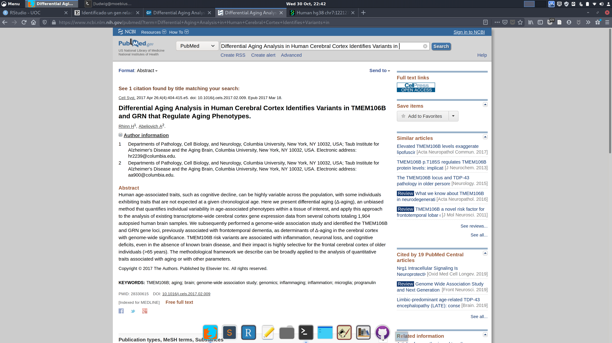
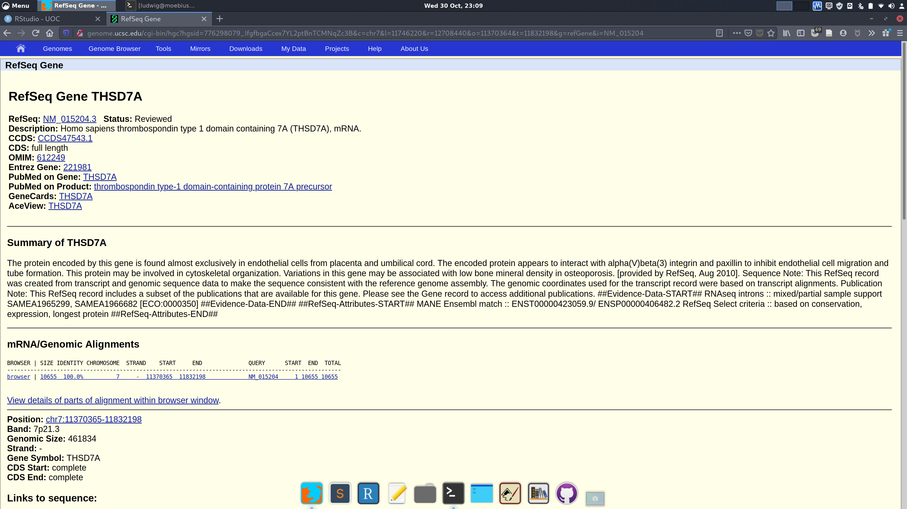

```{r setup, include=FALSE}
knitr::opts_chunk$set(echo = FALSE, out.width="100%")
```


# Ejercicio 1. 
## Anotar el gen de estudio [25%]
### 1. En primavera de 2017 conocimos la siguiente noticia a través de la mayoría de medios de comunicación. Leed el texto con atención, dado que utilizaremos esta información como base para nuestro ejercicio.
 
### 2. Conectaos a PUBMED y localizad el resumen (en inglés, Abstract) de esta publicación mencionada en el artículo anterior: 
http://www.ncbi.nlm.nih.gov/pubmed

Al revisar el artículo es fácil hacer una simple búsqueda  con el título y los autores en PubMed y obtener la ficha del articulo en referencia. 

```{r}

```


### 3. Con el servidor genómico UCSC, buscad las anotaciones del gen TMEM106 (Homo sapiens, hg38). Utilizaremos la anotación suministrada por RefSeq (track RefSeq Genes llamada también UCSC RefSeq). Anotad la localización genómica y los genes más cercanos:
http://genome.ucsc.edu

En primer lugar utilizo el navegador genómico para hacer seleccionar la base *Homo sapiens, hg38* y hacer la búsqueda del gen `TMEM106B`
Luego filtro las vistas para que sólo aparezcan las pistas de `RefSeq` y accedo a la información detallada. De la pantalla principal del navegador o de la del detalle de RefSeq podemos conocer la ubicación del gen, que tiene dos variantes.

> La ubicación genómica del gen TMEM106 es: 
  `chr7:12,211,294 - 12,243,367`

```{r}


```

Para poder apreciar mejor la región donde se encuentra este gen se puede hacer un *zoom out*, lo que permite apreciar algunos de los genes que se encuentran antes y después del gen `TMEM106B`. Algunos de los genes cercanos en la región son:

```{r}

```

 
 + **PHF14**, posición chr7:10973872-11107749.  *PHD finger protein 14*
 + **THSD7A**,  posición chr7:11370365-11832198. *thrombospondin type 1 domain containing 7A*
 + **VWDE**, posición chr7:12330885-12403941. *von Willebrand factor D and EGF domains*
 + **LOC102725191**, no caracterizado (aún...)
 + **SCIN**, posición chr7:12570720-12660181. *scinderin*
 + **ARL4A**, posición chr7:12686827-12690933. *ADP ribosylation factor like GTPase 4A*

### 4. Dentro de la ficha del gen según RefSeq, accede al registro de Entrez Gene y de OMIM para describir que funciones desempeña según Gene Ontology y en que enfermedades puede estar involucrado.

Desde la ficha del gen podemos acceder al enlace directo a la página de *Entrez Gene*. En la sección de *Gene Ontology* aparece la función del gen en un formato reducido. Una de las funciones que se puede destacar es la de *ligando de proteínas* que tiene un enlace a un artículo de PubMed (https://www.ncbi.nlm.nih.gov/pubmed/24357581).  El nombre del artículo (y el abstract) hablan de una "función en el control del tráfico dendrítico de lysosomas".

```{r}

```


La sección `GeneRif` permite obtener otros resultados que relacionan el gen con funciones específicas. En esta sección destaca la asociación que se hace de:

 + Variaciones genéticas del gen se asocian a diferentes fenotipos de envejecimiento.
 + Asociado a hipomielinización cerebral.
 + Asociado a la demencia fronto-temporal.


La ficha de OMIM especifica más las funciones;
 
 + El gen `TMEM106B` controla el tamaño, el número, la movilidad, el tráfico y la acidificación de los lisosomas (Klein et al., 2017)"
 + La sobreexpresión del gen `TMEM106B` se asocia a anormalidades en las fases tardías de la morfología de los endosomas y lisosomas...
(Chen-Plotkin et al., 2012)
 + La sobre expresion del gen `TMTM106B` se asoció a Neuroblastoma N2A en ratones, Glioblastoma T98G en humanos y en otras enfermedades de los lisosomas en ratones. (Brady et al., 2013)
 
 + Se ha asociado una mutación del gen `TMEM106B` a la Leucodistrofia hipomielinizante 16 (Simons et al. 2017)
 
 Como se puede concluir, la función del gen esta relacionada con el funcionamiento y regulación de los lisosomas. Alteraciones de este gen se relacionan con un desequilibrio en la función de los lisosomas que se puede traducir a diferentes condiciones; desde un fenotipo de envejecimiento diferente, a enfermedades neuro-degenerativas graves


### 5. Extraed de las anotaciones de RefSeq la región codificante (CDS, únicamente los exones) del gen TMEM106B humano. Repetid el mismo procedimiento para obtener la secuencia CDS ortóloga en el ratón (Mus musculus, mm10).
 
 Para extraer la región codificante, en primer lugar seccionamos el gen desde el navegador. En la página del detalle del gen, podemos seleccionar la sección `Genomic Sequence`. En esta sección podemos configurar una consulta para que nos devuelva solo la secuencia codificante CDS.
 
```{r}

```

 
 + La secuencia de exones de TMEM106B en humano es:
 
```
>hg38_refGene_NM_001134232 range=chr7:12214811-12231975 5'pad=0 3'pad=0 strand=+ repeatMasking=none
ATGGGAAAGTCTCTTTCTCATTTGCCTTTGCATTCAAGCAAAGAAGATGC
TTATGATGGAGTCACATCTGAAAACATGAGGAATGGACTGGTTAATAGTG
AAGTCCATAATGAAGATGGAAGAAATGGAGATGTCTCTCAGTTTCCATAT
GTGGAATTTACAGGAAGAGATAGTGTCACCTGCCCTACTTGTCAGGGAAC
AGGAAGAATTCCTAGGGGGCAAGAAAACCAACTGGTGGCATTGATTCCAT
ATAGTGATCAGAGATTAAGGCCAAGAAGAACAAAGCTGTATGTGATGGCT
TCTGTGTTTGTCTGTCTACTCCTTTCTGGATTGGCTGTGTTTTTCCTTTT
CCCTCGCTCTATCGACGTGAAATACATTGGTGTAAAATCAGCCTATGTCA
GTTATGATGTTCAGAAGCGTACAATTTATTTAAATATCACAAACACACTA
AATATAACAAACAATAACTATTACTCTGTCGAAGTTGAAAACATCACTGC
CCAAGTTCAATTTTCAAAAACAGTTATTGGAAAGGCACGCTTAAACAACA
TAACCATTATTGGTCCACTTGATATGAAACAAATTGATTACACAGTACCT
ACCGTTATAGCAGAGGAAATGAGTTATATGTATGATTTCTGTACTCTGAT
ATCCATCAAAGTGCATAACATAGTACTCATGATGCAAGTTACTGTGACAA
CAACATACTTTGGCCACTCTGAACAGATATCCCAGGAGAGGTATCAGTAT
GTCGACTGTGGAAGAAACACAACTTATCAGTTGGGGCAGTCTGAATATTT
AAATGTACTTCAGCCACAACAGTAA
```

 + Para obtener la región ortóloga en el ratón, cambiamos la base de datos del navegador y busco la ubicación del gen `TMEM106B`. Una vez encontrado el gen, seleccionamos el gen y desde la página del detalle del gen vuelvo a hacer la consulta por la región codificante CDS.

```
>mm10_refGene_NM_027992 range=chr6:13071744-13084326 5'pad=0 3'pad=0 strand=+ repeatMasking=none
ATGGGAAAGTCTCTTTCTCACTTACCTTTGCATTCAAATAAAGAAGATGG
CTATGATGGCGTTACATCGACAGACAATATGAGAAATGGATTGGTTAGCA
GTGAAGTGCACAACGAAGACGGAAGAAATGGAGATGTCTCTCAGTTCCCA
TATGTGGAATTTACTGGAAGAGATAGTGTCACTTGTCCCACTTGCCAAGG
AACAGGAAGAATTCCTAGGGGACAAGAAAACCAACTGGTGGCATTGATTC
CATATAGTGATCAGCGGTTACGGCCAAGAAGAACAAAGCTGTATGTGATG
GCGTCTGTGTTTGTCTGCCTGCTCCTGTCTGGATTGGCTGTGTTTTTTCT
TTTCCCTCGATCTATTGAGGTGAAGTACATTGGAGTAAAATCAGCCTATG
TCAGCTACGACGCTGAAAAGCGAACCATATATTTAAATATCACGAACACA
CTAAATATAACAAATAATAACTATTATTCTGTTGAAGTTGAAAACATCAC
TGCTCAAGTCCAGTTTTCAAAAACCGTGATTGGAAAGGCTCGTTTAAACA
ACATAACTAACATTGGCCCACTTGATATGAAGCAGATTGATTATACGGTA
CCCACAGTTATTGCAGAGGAAATGAGTTACATGTATGATTTCTGTACACT
GCTCTCCATCAAAGTGCACAACATAGTACTCATGATGCAAGTTACTGTAA
CAACAGCATACTTTGGACACTCTGAGCAGATATCTCAGGAAAGGTACCAG
TATGTCGACTGTGGAAGGAACACGACTTACCAGTTGGCCCAGTCTGAGTA
TCTAAATGTCCTTCAGCCACAACAATAA
```

### 6. El programa CLUSTAL Omega realiza alineamientos globales de dos o más secuencias. Conectaos al servidor de CLUSTAL Omega para alinear las dos secuencias CDS (humana y de ratón) obtenidas en el paso anterior.
http://www.ebi.ac.uk/Tools/msa/clustalo/

En primer lugar entro a la página. Utilizando la información de la pregunta anterior, realizo la consulta con las dos secuencias anteriores. 

```{r}

```


Lo que podemos observar, es que hay un ajuste bastante bueno entre las dos secuencias de genes, siendo las diferencias generalmente puntuales ( en general de una sola base )

### 7. Repetid este mismo alineamiento global, utilizando ahora las correspondientes proteínas de cada gen (que previamente debéis recuperar de la entrada de RefSeq). Valorad el grado de homología entre estas dos secuencias tanto a nivel genómico como a nivel de proteína.


Utilizo la misma metodología que en la pregunta 5, pero al momento de generar la consulta, solicito la `Predicted Protein`.

```
>NP_001127704 length=274
MGKSLSHLPLHSSKEDAYDGVTSENMRNGLVNSEVHNEDGRNGDVSQFPY
VEFTGRDSVTCPTCQGTGRIPRGQENQLVALIPYSDQRLRPRRTKLYVMA
SVFVCLLLSGLAVFFLFPRSIDVKYIGVKSAYVSYDVQKRTIYLNITNTL
NITNNNYYSVEVENITAQVQFSKTVIGKARLNNITIIGPLDMKQIDYTVP
TVIAEEMSYMYDFCTLISIKVHNIVLMMQVTVTTTYFGHSEQISQERYQY
VDCGRNTTYQLGQSEYLNVLQPQQ
```

```
>NP_082268 length=275
MGKSLSHLPLHSNKEDGYDGVTSTDNMRNGLVSSEVHNEDGRNGDVSQFP
YVEFTGRDSVTCPTCQGTGRIPRGQENQLVALIPYSDQRLRPRRTKLYVM
ASVFVCLLLSGLAVFFLFPRSIEVKYIGVKSAYVSYDAEKRTIYLNITNT
LNITNNNYYSVEVENITAQVQFSKTVIGKARLNNITNIGPLDMKQIDYTV
PTVIAEEMSYMYDFCTLLSIKVHNIVLMMQVTVTTAYFGHSEQISQERYQ
YVDCGRNTTYQLAQSEYLNVLQPQQ
```

Posteriormente vuelvo a la página de CLUSTAL y realizo la consulta de alineamiento usando esta ves las dos proteínas

```{r}

```

El ajuste de las proteínas es bastante bueno y de hecho parece mejor que el de ADN. Esto tiene sentido en la medida de que las hebras de ADN que las codifican tienen diferencias puntuales. Como la codifican de la transcripción permite que un aminoácido puede estar codificado por *más de una combinación* de tripletes de bases, es de esperar que la proteína se ajuste mejor que el ADN que la codifica, ya que es probable que una diferencia puntual de una base en un codón *no cambie* el aminoácido codificado.


### 8. Emplead la herramienta LiftOver para averiguar las coordenadas del mismo gen en la versión hg19 del genoma humano y en la versión mm9 del genoma del ratón, respectivamente.
https://genome.ucsc.edu/cgi-bin/hgLiftOver

Con la herramienta `LiftOver` se puede obtener fácilmente la ubicación del gen en las versiones hg19 de humano y con ésta, la versión mm9 del ratón.

```{r}

```

> *Secuencia original* **human - hg38:**  
`chr7:12211294-12243367`


> *Secuancia para la version* **human - hg19**:  
`chr7:12250920-12282993`

> *Secuencia para la version* **mouse - mm9**:  
`chr6:13019841-13042696`


# Ejercicio 2. 
## La herramienta BLAT del navegador de UCSC [25%]
### 1. La aplicación BLAT es una herramienta muy popular disponible dentro del servidor genómico de UCSC. Localizad su página web y definid en pocas palabras cuál es la función principal de este programa:
http://genome.ucsc.edu

BLAT es una herramienta que permite localizar secuencias de bases o proteínas en un set de genoma determinado. La herramienta permite obtener resultados a una consulta utilizando algoritmos de alineación que resultan rápidos y eficientes para las consultas de secuencias de bases y proteínas.


### 2. Emplead BLAT para identificar la ubicación de la secuencia CDS humana del gen TMEM106B dentro del genoma humano (hg38, cromosoma, coordenadas).

Utilizo la secuencia CDS del ejercicio 1 y hacemos la consulta para la secuencia. El resultado son varios candidatos, siendo el primero el que tiene un *score* mayor y el que efectivamente corresponde a la pista del gen TMTM106B que encontramos en el ejercicio 1.

```{r}

```


### 3. Emplead BLAT para localizar con la secuencia CDS humana del gen TMEM106B dónde se encuentra la ubicación de este mismo gen en el genoma del ratón (mm10, cromosoma, coordenadas).

En este caso, como en el anterior, utilizo la secuencia CDS del ejercicio 1. A diferencia del anterior, selecciono la base de datos de *mouse, mm19*. De esta manera realizo la consulta. 

```{r}

```

> El mejor candidato en mm10 se ubica en:
 `chr6, 13071744-13084326`

### 4. Emplead BLAT para localizar con la secuencia CDS humana del gen TMEM106B dónde se encuentra la ubicación de este mismo gen en el genoma del pollo (galGal4, cromosoma, coordenadas).

```{r}

```

Utilizo la misma metodología anterior, cambiando la base a la de *chicken, galGal4*.

> El mejor candidato en pollo (galGal4) se ubica en:
  `chr2, 26714104 - 26716947`
 
 
### 5. Ahora emplead BLAT con la proteína humana del gen TMEM106B sobre el mismo genoma del pollo (galGal4, cromosoma, coordenadas). Razonad sobre las diferencias entre este resultado y el obtenido en el punto anterior

```{r}

```

En este caso, comienzo con la secuencia de proteína del ejercicio 1 y buscamos la mejor alineación en la base *galGal4*.
> el mejor candidato en pollo (galGal4) se ubica en:
  `chr2, 26708501 - 26716944`
  
En este caso la codificación desde la proteína no coincide del todo con la que utiliza la región CDS del gen. A continuación pongo las pistas sobre el navegador para poder vizulizar mejor las diferencias. 
 
 
```{r}

```

Una primera vista confirma la información de la posición. La pista codificada desde la proteína comienza antes y se ajusta algo **mejor** que la pista codificada de la región CDS

```{r}
knitr::include_graphics("screen/blat_6.png")
```

Con un zoom mayor a una de las zonas codificantes permiten ver que la región codificada desde la proteína se ajusta mejor a la región del gen TMEM106B y tiene menos bases que no coinciden. La interpretación que hago de esto es que cada aminoácido de la proteína está representada por uno **o mas** codones de tripletes de bases. De esta manera un mismo aminoácido se puede codificar por dos o mas secuencias diferentes. En este caso es posible que secuencias diferentes del CDS terminen codificando la misma secuencia de aminoácido y des esta forma se explica que aunque las regiones CDS no calcen del todo, la proteína final si que termina calzando mejor (lo que hace que la transcripción inversa sea a su vez calce mejor). 


# Ejercicio 3. 
## La herramienta Table browser del navegador de UCSC [40%]
### 1. La aplicación Table browser es una herramienta muy útil para acceder a los datos de las pistas que constituyen el entorno gráfico disponible dentro del servidor genómico de UCSC. Localizad su página web y definid en pocas palabras cuál es la función principal de este programa:
http://genome.ucsc.edu

Para acceder a la página de `Table browser` se accede desde el menu `tools` de la página del navegador UCSC. La herramienta `Table browser` permite obtener la información del navegador de pistas de genes UCSC, en un formato de texto que es un formato mas compatible para otros softwares. El 
buscador permite realizar además búsquedas complejas a las tablas de datos de genes.

```{r}

```


### 2. Imaginemos un escenario real: estamos trabajando con el genoma humano (ensamblado hg38) y se nos plantean una serie de cuestiones prácticas. Encontrad la manera de responder a estas preguntas empleando el navegador de tablas sobre la pista RefSeq genes (track NCBI RefSeq, table UCSC RefSeq). Debéis añadir una breve descripción en el informe de cómo habéis logrado llegar a la solución.

- Número de pares de bases del genoma completo.
Para la primera consulta seleccionamos el genoma y tablas correspondientes, dejamos la región `genome` y hacemos la consulta de `summary/statistics`

```{r}

```

Según esta consulta el número total de bases es de:
 `item bases: 1,440,975,236`
 

- Número de tránscritos en total a lo largo del genoma.

DE las misma consulta anterior se obtiene que el número de trasncritos total es de:
`item count: 82,864`

- Listado de todos los tránscritos en el genoma (únicamente captura de los primeros cinco). Debéis mostrar solo los siguientes atributos: código de RefSeq del transcrito, cromosoma, hebra, inicio/final del transcrito, número de exones y nombre del gen.

En este caso utilizo la misma consulta, pero en este caso cambiamos `output format` para solicitar sólo aquellos atributos solicitados.

```
#hg38.refGene.bin	hg38.refGene.name	hg38.refGene.chrom	hg38.refGene.strand	hg38.refGene.txStart	hg38.refGene.txEnd	hg38.refGene.exonCount	hg38.refGene.name2
0	NM_000299	chr1	+	201283451	201332993	15	PKP1
0	NM_001276351	chr1	-	67092165	67134970	8	C1orf141
0	NM_001276352	chr1	-	67092165	67134970	9	C1orf141
0	NM_001005337	chr1	+	201283505	201332989	14	PKP1
0	NR_075077	chr1	-	67092165	67134970	10	C1orf141
```

- Número total y listado de los transcritos en la región chr7:12000000-13000000.

En esta consulta restringimos la búsqueda a la región solicitada `chr7:12000000-13000000` y hacemos la consulta. LA consulta entrega 16 trasncritos, con un total de  243,432 bases.

```
#hg38.refGene.bin	hg38.refGene.name	hg38.refGene.chrom	hg38.refGene.strand	hg38.refGene.txStart	hg38.refGene.txEnd	hg38.refGene.exonCount	hg38.refGene.name2
678	NM_001134232	chr7	+	12211293	12243367	8	TMEM106B
678	NM_018374	chr7	+	12211293	12243367	9	TMEM106B
679	NM_001346972	chr7	-	12330884	12403941	27	VWDE
679	NM_001346973	chr7	-	12330884	12403941	27	VWDE
679	NR_144534	chr7	-	12330884	12403941	30	VWDE
679	NM_001135924	chr7	-	12330884	12403865	29	VWDE
680	NR_136261	chr7	+	12496428	12541135	6	LOC102725191
680	NR_136262	chr7	+	12497245	12541135	4	LOC102725191
680	NR_136263	chr7	+	12504396	12541135	4	LOC102725191
10	NR_156701	chr7	+	12570719	12660181	15	SCIN
10	NM_001112706	chr7	+	12570719	12660181	16	SCIN
681	NM_033128	chr7	+	12589522	12653603	14	SCIN
681	NM_001037164	chr7	+	12686826	12690933	2	ARL4A
681	NM_212460	chr7	+	12686826	12690933	2	ARL4A
681	NM_001195396	chr7	+	12687285	12690933	2	ARL4A
681	NM_005738	chr7	+	12687632	12690958	2	ARL4A
```

- Extraed la custom track con los datos de la pregunta anterior (en formato BED), para añadirle una cabecera (track name=…) que os permita darle el nombre y el color que os resulte más atractivo. Cargar posteriormente la pista en el navegador (hg38) y comprobad que los exones encajan con los visualizados en la pista RefSeq original.

En primer lugar cambio la opción de `Output Format` para generar el formato BED. Agregamos un nombre (en este caso "Consulta_PEC") y copio el texto. Posteriormente vuelvo al navegador UCSC y desde aquí importo un *track perzonalizado*. Al mirar el track podemos ver que efectivamente corresponde con la región del track original e incluye varios genes, incluido el TMEM106b.  

```{r}

```

- Extraed ahora la secuencia CDS de todos estos tránscritos con el Table browser. Escoged una de las secuencias al azar y realizad un BLAT con ella para comprobar que encaja correctamente con el tránscrito de RefSeq anotado en esa localización.

En primer lugar cambio el *output format* a `sequence` y solicito solo las regiones CDS. Copio el texto de solo una de las secuencias.

```
>hg38_refGene_NM_001112706 range=chr7:12570787-12652715 5'pad=0 3'pad=0 strand=+ repeatMasking=none
ATGGCGCGGGAGCTATACCACGAAGAGTTCGCCCGGGCGGGCAAGCAGGC
GGGGCTGCAGGTCTGGAGGATTGAGAAGCTGGAGCTGGTGCCCGTGCCCC
AGAGCGCTCACGGCGACTTCTACGTCGGGGATGCCTACCTGGTGCTGCAC
ACGGCCAAGACGAGCCGAGGCTTCACCTACCACCTGCACTTCTGGCTCGG
AAAGGAGTGTTCCCAGGATGAAAGCACAGCTGCTGCCATCTTCACTGTTC
AGATGGATGACTATTTGGGTGGCAAGCCAGTGCAGAATAGAGAACTTCAA
GGATATGAGTCTAATGACTTTGTTAGCTATTTCAAAGGCGGTCTGAAATA
CAAGGCTGGAGGCGTGGCATCTGGATTAAATCATGTTCTTACGAACGACC
TGACAGCCAAGAGGCTCCTACATGTGAAGGGTCGTAGAGTGGTGAGAGCC
ACAGAAGTTCCCCTTAGCTGGGACAGTTTCAACAAGGGTGACTGCTTCAT
CATTGACCTTGGCACCGAAATTTATCAGTGGTGTGGTTCCTCGTGCAACA
AATATGAACGTCTGAAGGCAAACCAGGTAGCTACTGGCATTCGGTACAAT
GAAAGGAAAGGAAGGTCTGAACTAATTGTCGTGGAAGAAGGAAGTGAACC
CTCAGAACTTATAAAGGTCTTAGGGGAAAAGCCAGAGCTTCCAGATGGAG
GTGATGATGATGACATTATAGCAGACATAAGTAACAGGAAAATGGCTAAA
CTATACATGGTTTCAGATGCAAGTGGCTCCATGAGAGTGACTGTGGTGGC
AGAAGAAAACCCCTTCTCAATGGCAATGCTGCTGTCTGAAGAATGCTTTA
TTTTGGACCACGGGGCTGCCAAACAAATTTTCGTATGGAAAGGTAAAGAT
GCTAATCCCCAAGAGAGGAAGGCTGCAATGAAGACAGCTGAAGAATTTCT
ACAGCAAATGAATTATTCCAAGAATACCCAAATTCAAGTTCTTCCAGAAG
GAGGTGAAACACCAATCTTCAAACAGTTTTTTAAGGACTGGAGAGATAAA
GATCAGAGTGATGGCTTCGGGAAAGTTTATGTCACAGAGAAAGTGGCTCA
AATAAAACAAATTCCCTTTGATGCCTCAAAATTACACAGTTCTCCGCAGA
TGGCAGCCCAGCACAATATGGTGGATGATGGTTCTGGCAAAGTGGAGATT
TGGCGTGTAGAAAACAATGGTAGGATCCAAGTTGACCAAAACTCATATGG
TGAATTCTATGGTGGTGACTGCTACATCATACTCTACACCTATCCCAGAG
GACAGATTATCTACACGTGGCAAGGAGCAAATGCCACACGAGATGAGCTG
ACAACATCTGCGTTCCTGACTGTTCAGTTGGATCGGTCCCTTGGAGGACA
GGCTGTGCAGATCCGAGTCTCCCAAGGCAAAGAGCCTGTTCACCTACTGA
GTTTGTTCAAAGACAAACCGCTCATTATTTACAAGAATGGAACATCAAAG
AAAGGAGGTCAGGCACCTGCTCCCCCTACACGCCTCTTTCAAGTCCGGAG
AAACCTGGCATCTATCACCAGAATTGTGGAGGTTGATGTTGATGCAAATT
CACTGAATTCTAACGATGTTTTTGTCCTGAAACTGCCACAAAATAGTGGC
TACATCTGGGTAGGAAAAGGTGCTAGCCAGGAGGAGGAGAAAGGAGCAGA
GTATGTAGCAAGTGTCCTAAAGTGCAAAACCTTAAGGATCCAAGAAGGCG
AGGAGCCAGAGGAGTTCTGGAATTCCCTTGGAGGGAAAAAAGACTACCAG
ACCTCACCACTACTGGAAACCCAGGCTGAAGACCATCCACCTCGGCTTTA
CGGCTGCTCTAACAAAACTGGAAGATTTGTTATTGAAGAGATTCCAGGAG
AGTTCACCCAGGATGATTTAGCTGAAGATGATGTCATGTTACTAGATGCT
TGGGAACAGATATTTATTTGGATTGGCAAAGATGCTAATGAAGTTGAGAA
AAAAGAATCTCTGAAGTCTGCCAAAATGTACCTTGAGACAGACCCTTCTG
GAAGAGACAAGAGGACACCAATTGTCATCATAAAACAGGGCCATGAGCCA
CCCACATTCACAGGCTGGTTCCTGGGCTGGGATTCCAGCAAGTGGTAA
```

Accedo a la herramienta BLAT y desde aquí realizo la consulta para este transcrito. Con el resultado de esta consulta creo una nueva pista personalizada y vuelvo al navegador para mirar las pistas originales, la consulta de la pregunta anterior (BED de Table Browser) y la consulta del trascrito con la herramienta BLAT (Consulta_BLAT).

```{r}

```

Se puede observar que efectivamente el transcrito corresponde a unos de los genes de la región. En este caso corresponde al gen SCIN 

# Ejercicio 4. 
## La herramienta Biomart del navegador ENSEMBL [10%]
#### 1. Estudiad el modo de funcionamiento de la herramienta Biomart. Mostrad un ejemplo de cómo interrogar el genoma humano (hg38) para la búsqueda de datos sobre la región chr12:7,680,240-7,905,217. Por ejemplo, cómo obtener el listado de términos de Gene ontology para los genes que se encuentran en ese lugar del genoma o el listado de SNPs anotados en los mismos genes. http://www.ensembl.org/biomart/martview

La herramienta Biomart es otra herramienta que permite hacer consultas a bases de datos genéticas. En este caso tenemos una barra de herramientas lateral que permite modificar los parámetros de la consulta, y arriba en el menú podemos el elegir la base y tablas a consultar.

```{r}

```

Para realizar búsquedas especificas, en este caso utilizamos el filtro en el menú lateral `Filters` y filtramos la *Region* solicitada en la pregunta. 

Para obtener distintos tipos de atributos se puede modificar el menu `Attributes`.  Para obtener información de las SNP y anotaciones se puede mirar la sección `Variants` del menú. En este caso que miramos los elementos de *Gene Ontology*, vamos a la sección `Features > External` donde podemos seleccionar los campos a consultar. 

```{r}

```


