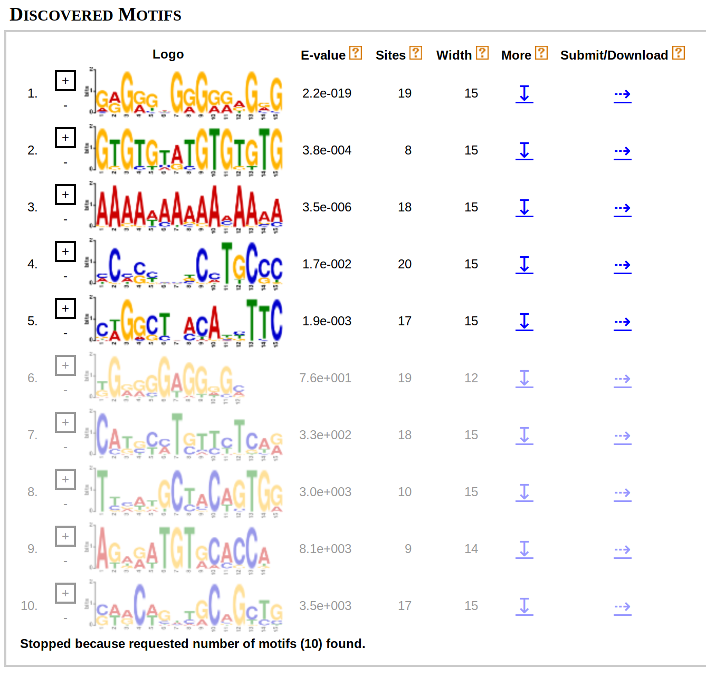
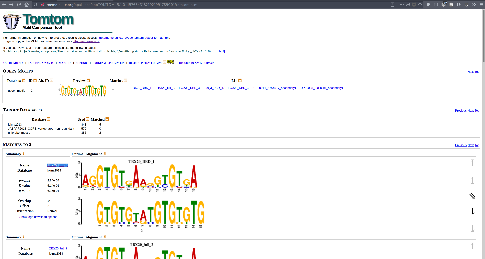
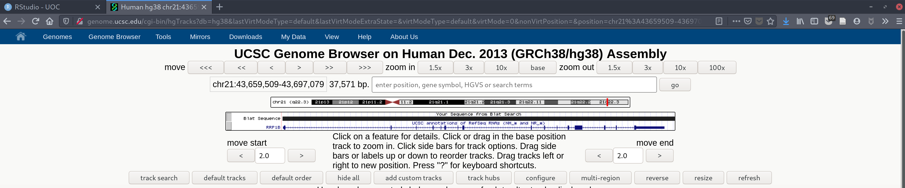
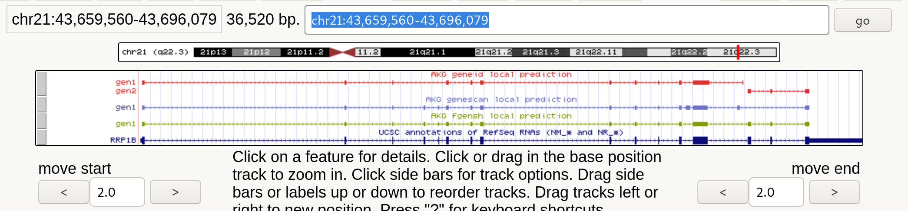
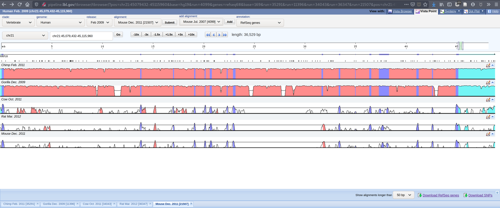

```{r setup, include=FALSE}
knitr::opts_chunk$set(echo = FALSE, out.width = "100%")
```

# Ejercicio 1. Estrategias de alineamiento [50%]
##### 1.El programa CLUSTAL realiza alineamientos globales de dos o más secuencias. Conectaos al servidor implementado en el EBI para comparar la secuencia CDS del gen TMEM106B obtenida desde RefSeq (UCSC) para humano y ratón en la PEC1 anterior (hg38 y mm10, respectivamente). http://www.ebi.ac.uk/Tools/msa/clustalo/


```
CLUSTAL O(1.2.4) multiple sequence alignment


human      ATGGGAAAGTCTCTTTCTCATTTGCCTTTGCATTCAAGCAAAGAAGATGCTTATGATGGA	60
mouse      ATGGGAAAGTCTCTTTCTCACTTACCTTTGCATTCAAATAAAGAAGATGGCTATGATGGC	60
           ******************** ** *************  **********  ******** 

human      GTCACATCT---GAAAACATGAGGAATGGACTGGTTAATAGTGAAGTCCATAATGAAGAT	117
mouse      GTTACATCGACAGACAATATGAGAAATGGATTGGTTAGCAGTGAAGTGCACAACGAAGAC	120
           ** *****    ** ** ***** ****** ******  ******** ** ** ***** 

human      GGAAGAAATGGAGATGTCTCTCAGTTTCCATATGTGGAATTTACAGGAAGAGATAGTGTC	177
mouse      GGAAGAAATGGAGATGTCTCTCAGTTCCCATATGTGGAATTTACTGGAAGAGATAGTGTC	180
           ************************** ***************** ***************

human      ACCTGCCCTACTTGTCAGGGAACAGGAAGAATTCCTAGGGGGCAAGAAAACCAACTGGTG	237
mouse      ACTTGTCCCACTTGCCAAGGAACAGGAAGAATTCCTAGGGGACAAGAAAACCAACTGGTG	240
           ** ** ** ***** ** *********************** ******************

human      GCATTGATTCCATATAGTGATCAGAGATTAAGGCCAAGAAGAACAAAGCTGTATGTGATG	297
mouse      GCATTGATTCCATATAGTGATCAGCGGTTACGGCCAAGAAGAACAAAGCTGTATGTGATG	300
           ************************ * *** *****************************

human      GCTTCTGTGTTTGTCTGTCTACTCCTTTCTGGATTGGCTGTGTTTTTCCTTTTCCCTCGC	357
mouse      GCGTCTGTGTTTGTCTGCCTGCTCCTGTCTGGATTGGCTGTGTTTTTTCTTTTCCCTCGA	360
           ** ************** ** ***** ******************** *********** 

human      TCTATCGACGTGAAATACATTGGTGTAAAATCAGCCTATGTCAGTTATGATGTTCAGAAG	417
mouse      TCTATTGAGGTGAAGTACATTGGAGTAAAATCAGCCTATGTCAGCTACGACGCTGAAAAG	420
           ***** ** ***** ******** ******************** ** ** * * * ***

human      CGTACAATTTATTTAAATATCACAAACACACTAAATATAACAAACAATAACTATTACTCT	477
mouse      CGAACCATATATTTAAATATCACGAACACACTAAATATAACAAATAATAACTATTATTCT	480
           ** ** ** ************** ******************** *********** ***

human      GTCGAAGTTGAAAACATCACTGCCCAAGTTCAATTTTCAAAAACAGTTATTGGAAAGGCA	537
mouse      GTTGAAGTTGAAAACATCACTGCTCAAGTCCAGTTTTCAAAAACCGTGATTGGAAAGGCT	540
           ** ******************** ***** ** *********** ** *********** 

human      CGCTTAAACAACATAACCATTATTGGTCCACTTGATATGAAACAAATTGATTACACAGTA	597
mouse      CGTTTAAACAACATAACTAACATTGGCCCACTTGATATGAAGCAGATTGATTATACGGTA	600
           ** ************** *  ***** ************** ** ******** ** ***

human      CCTACCGTTATAGCAGAGGAAATGAGTTATATGTATGATTTCTGTACTCTGATATCCATC	657
mouse      CCCACAGTTATTGCAGAGGAAATGAGTTACATGTATGATTTCTGTACACTGCTCTCCATC	660
           ** ** ***** ***************** ***************** *** * ******

human      AAAGTGCATAACATAGTACTCATGATGCAAGTTACTGTGACAACAACATACTTTGGCCAC	717
mouse      AAAGTGCACAACATAGTACTCATGATGCAAGTTACTGTAACAACAGCATACTTTGGACAC	720
           ******** ***************************** ****** ********** ***

human      TCTGAACAGATATCCCAGGAGAGGTATCAGTATGTCGACTGTGGAAGAAACACAACTTAT	777
mouse      TCTGAGCAGATATCTCAGGAAAGGTACCAGTATGTCGACTGTGGAAGGAACACGACTTAC	780
           ***** ******** ***** ***** ******************** ***** ***** 

human      CAGTTGGGGCAGTCTGAATATTTAAATGTACTTCAGCCACAACAGTAA	825
mouse      CAGTTGGCCCAGTCTGAGTATCTAAATGTCCTTCAGCCACAACAATAA	828
           *******  ******** *** ******* ************** ***

```

##### 2. Repetid este mismo alineamiento global, utilizando ahora las respectivas proteínas de este gen en cada especie (que previamente debéis volver a recuperar de la entrada de RefSeq). Valorad el grado de homología entre estas dos secuencias.

```
CLUSTAL O(1.2.4) multiple sequence alignment


human      MGKSLSHLPLHSSKEDAYDGVTS-ENMRNGLVNSEVHNEDGRNGDVSQFPYVEFTGRDSV	59
mouse      MGKSLSHLPLHSNKEDGYDGVTSTDNMRNGLVSSEVHNEDGRNGDVSQFPYVEFTGRDSV	60
           ************.***.****** :*******.***************************

human      TCPTCQGTGRIPRGQENQLVALIPYSDQRLRPRRTKLYVMASVFVCLLLSGLAVFFLFPR	119
mouse      TCPTCQGTGRIPRGQENQLVALIPYSDQRLRPRRTKLYVMASVFVCLLLSGLAVFFLFPR	120
           ************************************************************

human      SIDVKYIGVKSAYVSYDVQKRTIYLNITNTLNITNNNYYSVEVENITAQVQFSKTVIGKA	179
mouse      SIEVKYIGVKSAYVSYDAEKRTIYLNITNTLNITNNNYYSVEVENITAQVQFSKTVIGKA	180
           **:**************.:*****************************************

human      RLNNITIIGPLDMKQIDYTVPTVIAEEMSYMYDFCTLISIKVHNIVLMMQVTVTTTYFGH	239
mouse      RLNNITNIGPLDMKQIDYTVPTVIAEEMSYMYDFCTLLSIKVHNIVLMMQVTVTTAYFGH	240
           ****** ******************************:*****************:****

human      SEQISQERYQYVDCGRNTTYQLGQSEYLNVLQPQQ	274
mouse      SEQISQERYQYVDCGRNTTYQLAQSEYLNVLQPQQ	275
           **********************.************

```

La homología para las proteínas es bastante elevada, y  mayor a la de las secuencias de ADN. Esto tiene relación con la capacidad del ADN de codificar para un mismo AA a pesar de que una de las bases de los codones sea diferente. Para cada AA es usual que exista mas de una combinación de tripletes de bases. 


##### 3. El programa BLAST realiza alineamientos locales. Conectaos a BLAST, en el servidor principal del NCBI, para buscar qué versión de este programa debéis utilizar para alinear dos secuencias. Realizad ahora el alineamiento local de las dos regiones CDS del gen TMEM106B. http://www.ncbi.nlm.nih.gov/blast/

```
Query: human Query ID: lcl|Query_10551 Length: 825

>mouse
Sequence ID: Query_10553 Length: 828 
Range 1: 1 to 828

Score:1000 bits(541), Expect:0.0, 
Identities:733/828(89%),  Gaps:3/828(0%), Strand: Plus/Plus

Query  1    ATGGGAAAGTCTCTTTCTCATTTGCCTTTGCATTCAAGCAAAGAAGATGCTTATGATGGA  60
            |||||||||||||||||||| || |||||||||||||  ||||||||||  |||||||| 
Sbjct  1    ATGGGAAAGTCTCTTTCTCACTTACCTTTGCATTCAAATAAAGAAGATGGCTATGATGGC  60

Query  61   GTCACAT---CTGAAAACATGAGGAATGGACTGGTTAATAGTGAAGTCCATAATGAAGAT  117
            || ||||   | || || ||||| |||||| ||||||  |||||||| || || ||||| 
Sbjct  61   GTTACATCGACAGACAATATGAGAAATGGATTGGTTAGCAGTGAAGTGCACAACGAAGAC  120

Query  118  GGAAGAAATGGAGATGTCTCTCAGTTTCCATATGTGGAATTTACAGGAAGAGATAGTGTC  177
            |||||||||||||||||||||||||| ||||||||||||||||| |||||||||||||||
Sbjct  121  GGAAGAAATGGAGATGTCTCTCAGTTCCCATATGTGGAATTTACTGGAAGAGATAGTGTC  180

Query  178  ACCTGCCCTACTTGTCAGGGAACAGGAAGAATTCCTAGGGGGCAAGAAAACCAACTGGTG  237
            || || || ||||| || ||||||||||||||||||||||| ||||||||||||||||||
Sbjct  181  ACTTGTCCCACTTGCCAAGGAACAGGAAGAATTCCTAGGGGACAAGAAAACCAACTGGTG  240

Query  238  GCATTGATTCCATATAGTGATCAGAGATTAAGGCCAAGAAGAACAAAGCTGTATGTGATG  297
            |||||||||||||||||||||||| | ||| |||||||||||||||||||||||||||||
Sbjct  241  GCATTGATTCCATATAGTGATCAGCGGTTACGGCCAAGAAGAACAAAGCTGTATGTGATG  300

Query  298  GCTTCTGTGTTTGTCTGTCTACTCCTTTCTGGATTGGCTGTGTTTTTCCTTTTCCCTCGC  357
            || |||||||||||||| || ||||| |||||||||||||||||||| ||||||||||| 
Sbjct  301  GCGTCTGTGTTTGTCTGCCTGCTCCTGTCTGGATTGGCTGTGTTTTTTCTTTTCCCTCGA  360

Query  358  TCTATCGACGTGAAATACATTGGTGTAAAATCAGCCTATGTCAGTTATGATGTTCAGAAG  417
            ||||| || ||||| |||||||| |||||||||||||||||||| || || | | | |||
Sbjct  361  TCTATTGAGGTGAAGTACATTGGAGTAAAATCAGCCTATGTCAGCTACGACGCTGAAAAG  420

Query  418  CGTACAATTTATTTAAATATCACAAACACACTAAATATAACAAACAATAACTATTACTCT  477
            || || || |||||||||||||| |||||||||||||||||||| ||||||||||| |||
Sbjct  421  CGAACCATATATTTAAATATCACGAACACACTAAATATAACAAATAATAACTATTATTCT  480

Query  478  GTCGAAGTTGAAAACATCACTGCCCAAGTTCAATTTTCAAAAACAGTTATTGGAAAGGCA  537
            || |||||||||||||||||||| ||||| || ||||||||||| || ||||||||||| 
Sbjct  481  GTTGAAGTTGAAAACATCACTGCTCAAGTCCAGTTTTCAAAAACCGTGATTGGAAAGGCT  540

Query  538  CGCTTAAACAACATAACCATTATTGGTCCACTTGATATGAAACAAATTGATTACACAGTA  597
            || |||||||||||||| |  ||||| |||||||||||||| || |||||||| || |||
Sbjct  541  CGTTTAAACAACATAACTAACATTGGCCCACTTGATATGAAGCAGATTGATTATACGGTA  600

Query  598  CCTACCGTTATAGCAGAGGAAATGAGTTATATGTATGATTTCTGTACTCTGATATCCATC  657
            || || ||||| ||||||||||||||||| ||||||||||||||||| ||| | ||||||
Sbjct  601  CCCACAGTTATTGCAGAGGAAATGAGTTACATGTATGATTTCTGTACACTGCTCTCCATC  660

Query  658  AAAGTGCATAACATAGTACTCATGATGCAAGTTACTGTGACAACAACATACTTTGGCCAC  717
            |||||||| ||||||||||||||||||||||||||||| |||||| |||||||||| |||
Sbjct  661  AAAGTGCACAACATAGTACTCATGATGCAAGTTACTGTAACAACAGCATACTTTGGACAC  720


```


##### 4. Ahora utilizad el servidor de CLUSTAL para alinear globalmente la secuencia genomicA.txt y la secuencia genomicB.txt que encontraréis adjuntas a este enunciado.

```
CLUSTAL O(1.2.4) multiple sequence alignment


genomicA      cagaagaattgcttgaaccagggaggtggaggttgcagtgagcagagatcacgccactgc	60
genomicB      -----------------gctgggatg--tggggagcagtgttctgaggctgagcag-gac	40
                                * **** *    **  ******  * ***     **     *

genomicA      actcctgcttaagtgacagagtgagactccatctcaaaaaaaaaaaaaaaattcctatta	120
genomicB      agtgaggccttgggcctggcct----------ctgaaaccattttttccacctaggcctc	90
              * *   ** *  *     *  *          ** ***  *        *  *     * 

genomicA      tgtgcttgagtaataccacccactctggcaaatcttaaaaaagctcttggccgggtgcag	180
genomicB      tgagcctgtgtcctataacttattgcaggctgttagaagc------------aggcagac	138
              ** ** ** **  **  **  * *   *    *   **               **   * 

genomicA      tggctcatgcctgtaatccccagaagaattgcttgaaccagggaggtggaggttgcagtg	240
genomicB      tactttctggatgctttgctgcttagaatttttttctgcca-------------------	179
              *   *  **  **   * *     ******  **    *                     

genomicA      agcagagatcacgccactgcactcctgcttaagtgacagagtgagactccatctcaaaaa	300
genomicB      ----ga-----------tatcctaggtcatcactctATGAGTGTGGATCCAGCTTGT---	221
                  **           *   **    * * * *    ***** *  **** **      

genomicA      aaaaaaaaaaattcctattatgtgcttgagtaataccacccactctggcaaatcttaaaa	360
genomicB      ------------------------------------CCCCAAAGCTTGCCTTGCTTTGAA	245
                                                  * ** *  ** **    ***  **

genomicA      aagctcttggccgggtgcagtggctcatgcctgtaatcccATGGGAAAGTCTCTTTCTCA	420
genomicB      GCATCat--gggaggagctgtctctaagatctctaaagtgactttgaggccttttgctca	303
                    *  *   ** ** **  ** *   ** ***    *     * * ** ** ****

genomicA      TTTGCCTTTGCATTCAAGCAAAGAAGATGCagttccccatttctgtcgccacacctctga	480
genomicB      ttgtcttggatattagccctt---------ggcacccttttagtcacgctaatcccccta	354
              **  * *    ***    *            *  ***  **  *  *** *  ** *  *

genomicA      gatggtgcctgtgtctgtcattgtttcttgaatcaatctagacctcagttctaaagaacc	540
genomicB      gcaagtggttgctccacagcctgtttat-----------attcctctctc--aataatgc	401
              *   ***  **   *      ***** *           *  ****  *   **  *  *

genomicA      ctaaaaactctgtccgtgaatcttgggggaaggaggaagtcaatgtaaaatacttccata	600
genomicB      ttttttattctctgccacatgg--ctggctacgagttttccaaacttgta----tgcttt	455
               *    * *** * *   *       **  * ***     ***  *   *    * * * 

genomicA      ttgtatttctaagatgtctatttccccttt--gtgattattttgactgcaagtgtccgtg	658
genomicB      gtttcccttttaaatgtaagtttcagctttaagtcatttctttgcatggggagcagatga	515
               * *   * * * ****   ****  ****  ** ***  ****  **            

genomicA      aatcttgggggaaggaggaagtcaatgtaaaatacttccatattgtatttctaagatgtc	718
genomicB      atcatatggtgagagaggaagtcacagagagagactaggatgtggtaccagactcttaag	575
              *   *  ** **  **********  *  * * ***   ** * ***         *   

genomicA      tatttcccctttgtgattattttgactgcaagATGAGTGTGGATCCAGCTTGTCCCCAAA	778
genomicB      caatcaaatctcacgtgaactaactgagcaagaa----------gtgacttatcaccaag	625
               * *      *   *   * *      ******               *** ** **** 

genomicA      GCTTGCCTTGCTTTGAAGCATCagttccccattt-----------ctgtcgccacacctc	827
genomicB      gggtgttaaccattcatgagggatctgcccacatgatccaatcacctcccaccaggaaat	685
              *  **     * ** * *    *  * ****  *           **  * ***      

genomicA      tgagatggtgcctgtgtctgtcattgtttcttgaatcaatctagacctcagttctaaaga	887
genomicB      cacattggtttccaaATGGGAAAGTCTCTTTCTCATTTG---------CCTTTGCATTCA	736
                   ****  *    *  *  * * * * *   **            *  **  *   *

genomicA      accctaaaaactcagttccccatttctgtcgccacacctctgagatggtgcctgtgtctg	947
genomicB      AGCAAAGAAGATGCtgcccacatgatccaatcacctcccaccaggaaatcacattgggaa	796
              * *  * **  *     ** ***        *  * **    **    *  *  **    

genomicA      tcattgtttcttgaatcaatctagacctcagttctaaagaaccctaaaaactc	1000
genomicB      tcac-------------------------------------------------	800
              ***                                                  

```


##### 5. Proceded ahora a efectuar el alineamiento local con BLAST de la secuencia genómica genomicA.txt y la secuencia genomicB.txt adjuntadas con el enunciado.

```
Query: genomicA Query ID: lcl|Query_58539 Length: 1000

>genomicB
Sequence ID: Query_58541 Length: 800 
Range 1: 201 to 251

Score:95.3 bits(51), Expect:2e-23, 
Identities:51/51(100%),  Gaps:0/51(0%), Strand: Plus/Plus

Query  751  ATGAGTGTGGATCCAGCTTGTCCCCAAAGCTTGCCTTGCTTTGAAGCATCA  801
            |||||||||||||||||||||||||||||||||||||||||||||||||||
Sbjct  201  ATGAGTGTGGATCCAGCTTGTCCCCAAAGCTTGCCTTGCTTTGAAGCATCA  251


Range 2: 701 to 750

Score:93.5 bits(50), Expect:6e-23, 
Identities:50/50(100%),  Gaps:0/50(0%), Strand: Plus/Plus

Query  401  ATGGGAAAGTCTCTTTCTCATTTGCCTTTGCATTCAAGCAAAGAAGATGC  450
            ||||||||||||||||||||||||||||||||||||||||||||||||||
Sbjct  701  ATGGGAAAGTCTCTTTCTCATTTGCCTTTGCATTCAAGCAAAGAAGATGC  750

```


##### 6. Comparad los resultados del alineamiento global y local en los dos casos anteriores (2 CDSs o las secuencias genomicA.txt y genomicB.txt). Decidid cuál de los dos programas probados es más adecuado para cada caso en función de la estrategia empleada.

En el caso de alinear dos regiones CDS, dado que la preservación del codigo entre las especies es elevada, no hay mayor diferencia entre una alineamiento global con uno local. PAra alinear regiones CDS tiene mas sentido realizar una alineamiento global, que permita ver el grado de preservación y similitud de la proteína codificada. 

En este caso de alinear dos secuencias desconocidas, si que hay diferencias entre un alineamiento global y uno local. El alineamiento local sólo nos muestra aquellas regiones que preservan un alineamiento por sobre un limite determinado. En este caso detecta que las regiones locales que mejor se alinean son una región mas inicial (201-251) del `genomicB` con una final (751-801) del `genomicA` y otra alineación de una región final (701-750) de `genomicB` con una media (401-450) de `genomicA`. Al tener dos secuencias desconocidas, tiene mas sentido realizar un alineamiento local para valorar si las secuencias tienen elementos comunes reconocibles, como secuencias de control. 


##### 7. Unos investigadores que trabajan con el genoma del pollo (chicken) nos envían la secuencia adjunta genomicC.txt, pues sospechan que la forma ortóloga de nuestro gen TMEM106B está codificada en su interior. Decidid qué versión de BLAST debéis utilizar para validar esta hipótesis con la proteína humana (que tenéis de pasos previos), anotando su homóloga en esta región genómica de pollo. En caso de respuesta afirmativa, interpretad el grado de homología resultante entre ambas proteínas.


Esta pregunta la había formulado de dos maneras. Se podría utilizar el *tblastn* para que permite buscar secuencias de proteínas similares a la `TMEM106B`, o bien, utilizar *blastx* que permite buscar productos potenciales codificados en la secuencia de `genomicC.txt` y valorar su alineación con `TMEM106B`.

Por lo que entiendo de la pregunta, la Hipótesis que se baraja es que el *gen* ortólogo esta codificado en la secuencia, por lo que lo correcto sería utilizar la primera aproximación, es decir, utilizando *tblastn* para valorar si en la secuencia se encuentra el gen que codifica para la proteína que buscamos.

```
RID: Z9YBNTWX114	
Job Title:Protein Sequence 				
Program: TBLASTN 
Query: None ID: lcl|Query_24331(amino acid) Length: 274
Subject:genomicC ID: lcl|Query_24333(dna) Length: 21894
	
Sequences producing significant alignments:
                                                                  Max    Total Query   E   Per.                  
Description                                                       Score  Score cover Value Ident  Accession        
genomicC                                                          114    537   93%   1e-31 75.68  Query_24333      
```

La consulta devuelve 11 resultados de alineamiento. El resultado global es relativamente bueno, con una identificación del 75% y un valor e bajo. 

```{r fig.width=2}
knitr::include_graphics("screen/shot.png", dpi = 5)
```

En la gráfica se puede observar que si hay *scores* altos en varios de los resultados, pero a su vez, hay algunas regiones que no se alinean tan bien. 


##### 8. El programa MEME representa una familia alternativa de herramientas bioinformáticas para comparar secuencias. Definid en pocas palabras qué tipo de tarea realiza esta aplicación y cómo puede ser empleado dentro del área de estudio de la regulación génica mediante factores de transcripción:

Las herramientas contenidas en la plataforma MEME permiten la utilización de herramientas matemáticas para el análisis de patrones o *motivos* que se pueden encontrar en secuencias de nucleótidos o proteínas. LA búsqueda de *motivos* es esencial en la tares de encontrar los segmentos de la secuencias que codifican para proteínas como las que actúan como señales de control en la maquinaria de transcripción. 


##### 9. Vamos a estudiar la regulación transcripcional de nuestro gen TMEM106B a lo largo de la evolución. En primer lugar, empleando el navegador genómico de UCSC y las anotaciones de RefSeq, debéis extraer la región promotora del gen (seleccionad 5000 nucleótidos de longitud justo antes del inicio de transcripción del gen en cada especie) para estas especies: humano (hg38), ratón (mm10), rata (rn6) y pollo (galgal6).

##### 10. En segundo lugar, emplead el programa MEME para comparar esas cuatro secuencias ortólogas. Buscamos los 10 mejores motivos que posean una longitud entre 5 y 15 pares de bases. Explorad qué función puede jugar el programa TOMTOM integrado dentro de la suite de programas MEME y efectuad una prueba con alguno de los motivos identificados.

En este caso realicé la búsqueda utilizando la opción *any number of repetitions* en la sección de *Site Distribution*. Mi razonamiento fue que al ser la región promotora, me gustaría identificar patrones o *motivos* de esta región que se pueden repetir entre las especies o en cada secuencia. Además modifiqué los parámetros para buscar secuencias de entre 5 a 15 pares. 

```{r}

```

Buscamos ahora el *motivo* `GTGTGTATGTGTGTG`. La primera coincidencia encontrada en TOMTOM es con el factor de anclaje de ADN, una **caja-T**, la `TBX20_DBD_1`

```{r}

```


# Ejercicio 2. Anotación computacional de genes [50%]
**Estamos colaborando con un laboratorio de biología molecular que sospecha que la secuencia anónima.fa codifica un gen humano. Este fragmento genómico está representado en el formato FASTA habitual con una cabecera inicial y la secuencia a continuación (adjunto al enunciado):**


##### 1. Deseamos conocer las coordenadas de los exones que constituyen el gen codificado en esta secuencia. Como primer paso de nuestro protocolo de anotación, debéis utilizar el programa GENEID para recuperar el mejor gen identificado computacionalmente en esta región del genoma humano:

GENEID devuelve dos genes; uno primer gen de 11 exones y uno de 4 exones.

```
## date Thu Dec 12 12:44:56 2019
## source-version: geneid v 1.2 -- geneid@imim.es
# Sequence human - Length = 37571 bps
# Optimal Gene Structure. 2 genes. Score = 31.87 
# Gene 1 (Forward). 11 exons. 622 aa. Score = 31.58 
   First      157      286	 9.81	+ 0 1	 8.07	 2.83	20.67	 0.00	AA   1: 44 human_1
Internal    10376    10458	 1.45	+ 2 0	 5.58	 2.65	 3.77	 0.00	AA  44: 71 human_1
Internal    12800    12857	 0.89	+ 0 1	 3.87	 3.09	 5.54	 0.00	AA  72: 91 human_1
Internal    15504    15655	-0.00	+ 2 0	 0.91	 4.65	 5.41	 0.00	AA  91:141 human_1
Internal    16764    16828	 1.03	+ 0 2	 4.32	 1.67	 6.10	 0.00	AA 142:163 human_1
Internal    17225    17406	 5.73	+ 1 1	 3.69	 3.72	15.71	 0.00	AA 163:224 human_1
Internal    23771    23865	-1.35	+ 2 0	-0.44	 3.68	 4.25	 0.00	AA 224:255 human_1
Internal    25045    25142	 2.96	+ 0 2	 3.54	 0.05	14.52	 0.00	AA 256:288 human_1
Internal    26262    26281	 2.17	+ 1 1	 6.90	 4.53	 0.77	 0.00	AA 288:295 human_1
Internal    27296    27427	 2.70	+ 2 1	 0.45	 5.26	10.70	 0.00	AA 295:339 human_1
Terminal    28008    28858	 6.20	+ 2 0	 4.56	 0.00	21.14	 0.00	AA 339:622 human_1

# Gene 2 (Forward). 4 exons. 141 aa. Score = 0.28 
   First    30518    30529	-2.92	+ 0 0	 1.42	 1.23	 1.21	 0.00	AA   1:  4 human_2
Internal    30780    30932	 0.68	+ 0 0	 2.81	 3.31	 5.01	 0.00	AA   5: 55 human_2
Internal    31931    31994	 2.93	+ 0 1	 4.88	 4.80	 5.31	 0.00	AA  56: 77 human_2
Terminal    33682    33875	-0.40	+ 2 0	-0.70	 0.00	12.53	 0.00	AA  77:141 human_2

```

##### 2. Como segundo componente de nuestro pipeline, debéis emplear GENSCAN para recuperar el gen codificado internamente en esta secuencia humana:


GENSCAN devuelve un gen con 19 intrones, + una señal poly A

```
GENSCAN Output
View gene model output: PS | PDF
GENSCAN 1.0	Date run: 12-Dec-119	Time: 06:10:40

Sequence /tmp/12_12_19-06:10:39.fasta : 37571 bp : 47.68% C+G : Isochore 2 (43 - 51 C+G%)
Parameter matrix: HumanIso.smat
Predicted genes/exons:

Gn.Ex Type S .Begin ...End .Len Fr Ph I/Ac Do/T CodRg P.... Tscr..

----- ---- - ------ ------ ---- -- -- ---- ---- ----- ----- ------
 1.01 Init +    157    286  130  0  1  107   80   324 0.752  33.81
 1.02 Intr +  10376  10458   83  0  2   94   92    26 0.829   2.96
 1.03 Intr +  12800  12857   58  1  1   97   99    62 0.963   6.66
 1.04 Intr +  14362  14447   86  2  2   47   95    49 0.678   1.04
 1.05 Intr +  15128  15189   62  1  2   53   86    51 0.694  -1.07
 1.06 Intr +  15526  15655  130  1  1   27   99   108 0.642   6.50
 1.07 Intr +  16764  16828   65  2  2   78   83    73 0.995   3.32
 1.08 Intr +  17225  17406  182  2  2   77   91   192 0.962  17.91
 1.09 Intr +  23771  23865   95  0  2   37   94    55 0.688   0.68
 1.10 Intr +  25045  25142   98  0  2   64   26   129 0.640   3.11
 1.11 Intr +  26262  26281   20  0  2   91  100    -1 0.600  -2.35
 1.12 Intr +  27296  27427  132  0  0   41  121   120 0.872  11.22
 1.13 Intr +  27663  27851  189  1  0   51   67    92 0.625   2.96
 1.14 Intr +  28008  28732  725  1  2   85   95   470 0.762  38.55
 1.15 Intr +  30236  30380  145  1  1   71   48    71 0.368   1.26
 1.16 Intr +  30589  30671   83  2  2   30   51    91 0.478  -1.04
 1.17 Intr +  30780  30932  153  2  0  100  101   109 0.999  13.67
 1.18 Intr +  31931  31994   64  1  1  114  131    52 0.996  10.39
 1.19 Term +  33682  33875  194  2  2   52   55   187 0.999   9.38
 1.20 PlyA +  35500  35505    6                              -0.45
```


##### 3. Finalmente, como tercer componente del proceso, utilizad el programa FGENESH para identificar también la predicción de este sistema:


FGNESH identifica 16 exones + region Poly A

```
FGENESH 2.6 Prediction of potential genes in Homo_sapiens genomic DNA
 Time    :   Thu Dec 12 06:14:21 2019
 Seq name: human 
 Length of sequence: 37571 
 Number of predicted genes 1: in +chain 1, in -chain 0.
 Number of predicted exons 16: in +chain 16, in -chain 0.
 Positions of predicted genes and exons: Variant   1 from   1, Score:115.993872 
   G Str   Feature   Start        End    Score           ORF           Len

   1 +    1 CDSf       157 -       286   28.30       157 -       285    129
   1 +    2 CDSi     10376 -     10458    7.43     10378 -     10458     81
   1 +    3 CDSi     12800 -     12857    6.33     12800 -     12856     57
   1 +    4 CDSi     14362 -     14447    3.34     14364 -     14447     84
   1 +    5 CDSi     15128 -     15189    2.40     15128 -     15187     60
   1 +    6 CDSi     15526 -     15655    6.39     15527 -     15655    129
   1 +    7 CDSi     16764 -     16828    6.62     16764 -     16826     63
   1 +    8 CDSi     17225 -     17406   12.24     17226 -     17405    180
   1 +    9 CDSi     23771 -     23865    2.10     23773 -     23865     93
   1 +   10 CDSi     25045 -     25142    0.60     25045 -     25140     96
   1 +   11 CDSi     26262 -     26281   -1.21     26263 -     26280     18
   1 +   12 CDSi     27296 -     27427    8.29     27298 -     27426    129
   1 +   13 CDSi     28008 -     28732   33.29     28010 -     28732    723
   1 +   14 CDSi     30780 -     30932    9.89     30780 -     30932    153
   1 +   15 CDSi     31931 -     31994   13.04     31931 -     31993     63
   1 +   16 CDSl     33682 -     33875    1.90     33684 -     33875    192
   1 +      PolA     33923               -4.47
```


##### 4. Para evaluar la coherencia de las predicciones obtenidas por cada programa, emplead CLUSTAL para comparar las proteínas reportadas por GENEID, GENSCAN y FGENESH. Realizad una primera interpretación de estos resultados en el contexto de este alineamiento global.

```
CLUSTAL O(1.2.4) multiple sequence alignment


GENEID        MAPAMQPAEIQFAQRLASSEKGIRDRAVKKLRQYISVKTQRETGGFSQEELLKIWKGLFY	60
GENESCAN      MAPAMQPAEIQFAQRLASSEKGIRDRAVKKLRQYISVKTQRETGGFSQEELLKIWKGLFY	60
FGENESH       MAPAMQPAEIQFAQRLASSEKGIRDRAVKKLRQYISVKTQRETGGFSQEELLKIWKGLFY	60
              ************************************************************

GENEID        CMWVQDEPLLQEELANTIAQLVHAVNNSAAQAC---------------------------	93
GENESCAN      CMWVQDEPLLQEELANTIAQLVHAVNNSAAQHLFIQTFWQTMNREWKGIDRLRLDKYYML	120
FGENESH       CMWVQDEPLLQEELANTIAQLVHAVNNSAAQHLFIQTFWQTMNREWKGIDRLRLDKYYML	120
              *******************************                             

GENEID        ---------------VWFFSRIKVFLDVLMKEVLCPESQSPNGVRFHFIDIYLDELSKVG	138
GENESCAN      IRLVLRQSFEVLKRNGWEESRIKVFLDVLMKEVLCPESQSPNGVRFHFIDIYLDELSKVG	180
FGENESH       IRLVLRQSFEVLKRNGWEESRIKVFLDVLMKEVLCPESQSPNGVRFHFIDIYLDELSKVG	180
                              *  *****************************************

GENEID        GKELLADQNLKFIDPFCKIAAKTKDHTLVQTIARGVFEAIVDQSPFVPEETMEEQKTKVG	198
GENESCAN      GKELLADQNLKFIDPFCKIAAKTKDHTLVQTIARGVFEAIVDQSPFVPEETMEEQKTKVG	240
FGENESH       GKELLADQNLKFIDPFCKIAAKTKDHTLVQTIARGVFEAIVDQSPFVPEETMEEQKTKVG	240
              ************************************************************

GENEID        DGDLSAEEIPENEVSLRRAVSKKKTALGKNHSRKDGLSDERGRDDCGTFEDTGPLLQFDY	258
GENESCAN      DGDLSAEEIPENEVSLRRAVSKKKTALGKNHSRKDGLSDERGRDDCGTFEDTGPLLQFDY	300
FGENESH       DGDLSAEEIPENEVSLRRAVSKKKTALGKNHSRKDGLSDERGRDDCGTFEDTGPLLQFDY	300
              ************************************************************

GENEID        KAVADRLLEMTSRKNTPHFNRKRLSKLIKKFQDLSEGSSISQLSFAEDISADEDDQILSQ	318
GENESCAN      KAVADRLLEMTSRKNTPHFNRKRLSKLIKKFQDLSEGSSISQLSFAEDISADEDDQILSQ	360
FGENESH       KAVADRLLEMTSRKNTPHFNRKRLSKLIKKFQDLSEGSSISQLSFAEDISADEDDQILSQ	360
              ************************************************************

GENEID        GKHKKKGNKLLEKTNLEKE-----------------------------------------	337
GENESCAN      GKHKKKGNKLLEKTNLEKEKGKQELQGALGGGCLMTTRDLWFLPLSPKISGNGTISVPYV	420
FGENESH       GKHKKKGNKLLEKTNLEKE-----------------------------------------	379
              *******************                                         

GENEID        ----------------------KGSRVFCVEEEDSESSLQKRRRKKKKKHHLQPENPGPG	375
GENESCAN      FINGQKEGFQSQLGMEEVGPDDKGSRVFCVEEEDSESSLQKRRRKKKKKHHLQPENPGPG	480
FGENESH       ----------------------KGSRVFCVEEEDSESSLQKRRRKKKKKHHLQPENPGPG	417
                                    **************************************

GENEID        GAAPSLEQNRGREPEASGLKALKARVAEPGAEATSSTGEESGSEHPPAVPMHNKRKRPRK	435
GENESCAN      GAAPSLEQNRGREPEASGLKALKARVAEPGAEATSSTGEESGSEHPPAVPMHNKRKRPRK	540
FGENESH       GAAPSLEQNRGREPEASGLKALKARVAEPGAEATSSTGEESGSEHPPAVPMHNKRKRPRK	477
              ************************************************************

GENEID        KSPRAHREMLESAVLPPEDMSQSGPSGSHPQGPRGSPTGGAQLLKRKRKLGVVPVNGSGL	495
GENESCAN      KSPRAHREMLESAVLPPEDMSQSGPSGSHPQGPRGSPTGGAQLLKRKRKLGVVPVNGSGL	600
FGENESH       KSPRAHREMLESAVLPPEDMSQSGPSGSHPQGPRGSPTGGAQLLKRKRKLGVVPVNGSGL	537
              ************************************************************

GENEID        STPAWPPLQQEGPPTGPAEGANSHTTLPQRRRLQKKKAGPGSLELCGLPSQKTASLKKRK	555
GENESCAN      STPAWPPLQQEGPPTGPAEGANSHTTLPQRRRLQKKKAGPGSLELCGLPSQKTASLKKRK	660
FGENESH       STPAWPPLQQEGPPTGPAEGANSHTTLPQRRRLQKKKAGPGSLELCGLPSQKTASLKKRK	597
              ************************************************************

GENEID        KMRVMSNLVEHNGVLESEAGQPQALVRWEHP--------------QASSPQRHSL-ASMG	600
GENESCAN      KMRVMSNLVEHNGVLESEAGQPQALAAHLNLPEPPVCRQRHWAAHTSESQVRDPVSLWVA	720
FGENESH       KMRVMSNLVEHNGVLESEAGQPQAL-----------------------------------	622
              *************************                                   

GENEID        LHCLLRGR---------------VGAGGQASGLSSS*MKIKGSSGTCSSLKKQKLRAESD	644
GENESCAN      VSCCTRNECPGPASVVLCVKPELCRMEGLSASAVRKTAGRRGSSGTCSSLKKQKLRAESD	780
FGENESH       -----------------------------------------GSSGTCSSLKKQKLRAESD	641
                                                       *******************

GENEID        FVKFDTPFLPKPLFFRRAKSSTATHPPGPAVQLNKTPSSSKKVTFGLNRNMTAEFKKTDK	704
GENESCAN      FVKFDTPFLPKPLFFRRAKSSTATHPPGPAVQLNKTPSSSKKVTFGLNRNMTAEFKKTDK	840
FGENESH       FVKFDTPFLPKPLFFRRAKSSTATHPPGPAVQLNKTPSSSKKVTFGLNRNMTAEFKKTDK	701
              ************************************************************

GENEID        SILVSPTGPSRVAFDPEQKPLHGVLKTPTSSPASSPLVAKKPLTTTPRRRPRAMDFF*	761
GENESCAN      SILVSPTGPSRVAFDPEQKPLHGVLKTPTSSPASSPLVAKKPLTTTPRRRPRAMDFF-	897
FGENESH       SILVSPTGPSRVAFDPEQKPLHGVLKTPTSSPASSPLVAKKPLTTTPRRRPRAMDFF-	758
              ********************************************************* 
```

En este primer resultado se observa que el alineamiento global de las tres versiones es bueno. Al analizar con mas detalle destacan que GENEID tiene mas *gaps* al inicio y FGNESH mas *gaps* al final. Otro factor importante es GENEID identifica **dos** genes diferentes, y GENESCAN y FGNESH sólo 1. En este caso he decidido concatenar lod dos genes de GENEID. Aun así la alineación de GENEID es la que mas difiere de las otras dos. 


##### 5. Finalmente, para comparar cuantitativamente los tres sistemas de predicción, rellenad la siguiente tabla con las coordenadas de todos los exones identificados dentro del mejor gen presentado por cada programa. Seleccionad dos de estos exones para realizar una búsqueda con BLASTP contra la base de datos completa de proteínas. Interpretad estos resultados para elaborar una primera anotación factible de este gen en función de estas predicciones:


| coordenadas    | GENEID | GENSCAN | FGENSH |
|----------------|--------|---------|--------|
|  157   - 286   |    X   |    X    |   X    | 
|  10376 - 10458 |    X   |    X    |   X    |	
|  12800 - 12857 |    X   |    X    |   X    |
|  14362 - 14447 |        |    X    |   X    |
|  15128 - 15189 |        |    X    |   X    |
|  15526 - 15655 |    X¹  |    X    |   X    |
|  16764 - 16828 |    X   |    X    |   X    |	
|  17225 - 17406 |    X   |    X    |   X    |	
|  23771 - 23865 |    X   |    X    |   X    |
|  25045 - 25142 |    X   |    X    |   X    |	
|  26262 - 26281 |    X   |    X    |   X    |	
|  27296 - 27427 |    X   |    X    |   X    |
|  27663 - 27851 |        |    X    |        |
|  28008 - 28732 |    X²  |    X    |   X    |
|  30236 - 30380 |        |    X    |        |
|  30518 - 30529 |   X³   |         |        | 	
|  30780 - 30932 |   X³   |         |   X    |	
|  31931 - 31994 |   X³   |         |   X    |	
|  33682 - 33875 |   X³   |    X    |   X    |

¹: GENEID identifica que el exón comienza en 15504  
²: GENEID identifica que el exón termina en 28858   
³: Estos exones corresponden a un **segundo** gen segun GENEID  


**Busqueda con BLASTp**

```
Query: 1 Query ID: lcl|Query_86461 Length: 44

>RRP1B protein, partial [Homo sapiens]
Sequence ID: AAH14005.1 Length: 408 
Range 1: 1 to 44

Score:91.3 bits(225), Expect:4e-23, 
Method:Compositional matrix adjust., 
Identities:44/44(100%), Positives:44/44(100%), Gaps:0/44(0%)

Query  1   MAPAMQPAEIQFAQRLASSEKGIRDRAVKKLRQYISVKTQRETG  44
           MAPAMQPAEIQFAQRLASSEKGIRDRAVKKLRQYISVKTQRETG
Sbjct  1   MAPAMQPAEIQFAQRLASSEKGIRDRAVKKLRQYISVKTQRETG  44

```


```
Query: 2 Query ID: lcl|Query_86462 Length: 62

>RRP1B protein, partial [Homo sapiens]
Sequence ID: AAH14005.1 Length: 408 
Range 1: 205 to 266

Score:127 bits(318), Expect:5e-36, 
Method:Compositional matrix adjust., 
Identities:62/62(100%), Positives:62/62(100%), Gaps:0/62(0%)

Query  1    DHTLVQTIARGVFEAIVDQSPFVPEETMEEQKTKVGDGDLSAEEIPENEVSLRRAVSKKK  60
            DHTLVQTIARGVFEAIVDQSPFVPEETMEEQKTKVGDGDLSAEEIPENEVSLRRAVSKKK
Sbjct  205  DHTLVQTIARGVFEAIVDQSPFVPEETMEEQKTKVGDGDLSAEEIPENEVSLRRAVSKKK  264

Query  61   TA  62
            TA
Sbjct  265  TA  266
```


En ambos casos la consulta de los exones identifica (parte de) la proteína `RRP1B` localizada en el cromosoma 21, ubicado en 43,659,560-43,696,079 en la hebra positiva. 

#### 6. Aprovechad BLAT para identificar en qué parte del genoma humano se encuentra anonima.fa (cromosoma, inicio, final, hebra). Verificad visualmente que el inicio y el final de nuestra secuencia encajan con la región correcta.


```{r}

```


##### 7. Convertid manualmente nuestras predicciones de GENEID, GENSCAN y FGENESH en formato GFF para visualizarlas como Custom tracks en UCSC (será necesario adaptar las coordenadas de los exones para trasladarlos sobre el cromosoma 21): 

REalizamos la conversión y creamos el archivo GFF

```
browser position chr21:43657160-43699428
track name=GENEID	description="AKG geneid local prediction" visibility=2 color=220,50,47
chr21	Man	exon	43659664	43659793	1000	+	.	gen1
chr21	Man	exon	43669883	43669965	1000	+	.	gen1
chr21	Man	exon	43672307	43672364	1000	+	.	gen1
chr21	Man	exon	43675011	43675162	1000	+	.	gen1
chr21	Man	exon	43676271	43676335	1000	+	.	gen1
chr21	Man	exon	43676732	43676913	1000	+	.	gen1
chr21	Man	exon	43683278	43683372	1000	+	.	gen1
chr21	Man	exon	43684552	43684649	1000	+	.	gen1
chr21	Man	exon	43685769	43685788	1000	+	.	gen1
chr21	Man	exon	43686803	43686934	1000	+	.	gen1
chr21	Man	exon	43687515	43688365	1000	+	.	gen1
chr21	Man	exon	43690025	43690036	1000	+	.	gen1
chr21	Man	exon	43690287	43690439	1000	+	.	gen2
chr21	Man	exon	43691438	43691501	1000	+	.	gen2
chr21	Man	exon	43693189	43693382	1000	+	.	gen2
track name=GENESCAN	description="AKG genescan local prediction" visibility=2 color=108,113,196
chr21	Man	exon	43659664	43659793	1000	+	.	gen1
chr21	Man	exon	43669883	43669965	1000	+	.	gen1
chr21	Man	exon	43672307	43672364	1000	+	.	gen1
chr21	Man	exon	43673869	43673954	1000	+	.	gen1
chr21	Man	exon	43674635	43674696	1000	+	.	gen1
chr21	Man	exon	43675033	43675162	1000	+	.	gen1
chr21	Man	exon	43676271	43676335	1000	+	.	gen1
chr21	Man	exon	43676732	43676913	1000	+	.	gen1
chr21	Man	exon	43683278	43683372	1000	+	.	gen1
chr21	Man	exon	43684552	43684649	1000	+	.	gen1
chr21	Man	exon	43685769	43685788	1000	+	.	gen1
chr21	Man	exon	43686803	43686934	1000	+	.	gen1
chr21	Man	exon	43687170	43687358	1000	+	.	gen1
chr21	Man	exon	43687515	43688239	1000	+	.	gen1
chr21	Man	exon	43689743	43689887	1000	+	.	gen1
chr21	Man	exon	43693189	43693382	1000	+	.	gen1
track name=FGENSH	description="AKG fgensh local prediction" visibility=2 color=133,153,0
chr21	Man	exon	43659664	43659793	1000	+	.	gen1
chr21	Man	exon	43669883	43669965	1000	+	.	gen1
chr21	Man	exon	43672307	43672364	1000	+	.	gen1
chr21	Man	exon	43673869	43673954	1000	+	.	gen1
chr21	Man	exon	43674635	43674696	1000	+	.	gen1
chr21	Man	exon	43675033	43675162	1000	+	.	gen1
chr21	Man	exon	43676271	43676335	1000	+	.	gen1
chr21	Man	exon	43676732	43676913	1000	+	.	gen1
chr21	Man	exon	43683278	43683372	1000	+	.	gen1
chr21	Man	exon	43684552	43684649	1000	+	.	gen1
chr21	Man	exon	43685769	43685788	1000	+	.	gen1
chr21	Man	exon	43686803	43686934	1000	+	.	gen1
chr21	Man	exon	43687515	43688239	1000	+	.	gen1
chr21	Man	exon	43690287	43690439	1000	+	.	gen1
chr21	Man	exon	43691438	43691501	1000	+	.	gen1
chr21	Man	exon	43693189	43693382	1000	+	.	gen1
```

```{r}

```


##### 8. Emplead el Table Browser de UCSC para calcular la correlación, dentro de la región genómica delimitada por la secuencia anonima.fa, entre las predicciones de (a) GENEID y GENSCAN, (b) GENEID y FGENESH, (c) GENSCAN y FGENESH. A continuación, repetid el mismo procedimiento para calcular la correlación entre cada predicción individual y el gen anotado por el consorcio RefSeq.**  
  


 1. Correlaciones entre las predicciones
 * chr21:43,657,160-43,699,428
 * 42,269 data points 

 (a) Correlacion entre GENEID y GENSCAN
 
| r     | r²   | Track    | Min | Max | Mean  | Var   |  SD   |  Reg line (m - b) |
|:------|:----:|:---------|:---:|:---:|:-----:|:-----:|:-----:|:-----------------:|
| 0.806 | 0.65 | GENEID   | 0   | 1   | 0.054 | 0.051 | 0.226 |  0.789  -  0.009  |
|       |      | GENESCAN | 0   | 1   | 0.057 | 0.053 | 0.231 |                   |

 (b) Correlacion entre GENEID y FGNESH
 
| r     | r²   | Track    | Min | Max | Mean  | Var   |  SD   |  Reg line (m - b) |
|:------|:----:|:---------|:---:|:---:|:-----:|:-----:|:-----:|:-----------------:|
| 0.929 | 0.863| GENEID   | 0   | 1   | 0.054 | 0.051 | 0.226 |  0.931  -  0.004  |
|       |      | FGENSH   | 0   | 1   | 0.054 | 0.051 | 0.226 |                   |


 (c) Correlación entre GENSCAN y FGNESH
 
| r     | r²   | Track    | Min | Max | Mean  | Var   |  SD   |  Reg line (m - b) |
|:------|:----:|:---------|:---:|:---:|:-----:|:-----:|:-----:|:-----------------:|
| 0.876 | 0.766| GENESCAN | 0   | 1   | 0.056 | 0.053 | 0.231 |  0.896  -  0.008  |
|       |      | FGENSH   | 0   | 1   | 0.054 | 0.051 | 0.226 |                   |


En este caso se puede observar que GENID correlaciona mejor con FGNESH


----
 2. Correlaciones con RefSeq
 * chr21:43,659,560-43,696,079
 * 36,520 data points 

   (a) Correlacion entre RefSeq y GENEID

| r     | r²   | Track       | Min | Max | Mean  | Var   |  SD   |  Reg line (m - b) |
|:------|:----:|:------------|:---:|:---:|:-----:|:-----:|:-----:|:-----------------:|
| 0.587 | 0.345| UCSC RefSeq | 0   | 1   | 0.139 | 0.12  | 0.346 |  0.838  -  0.087  |
|       |      | GENEID      | 0   | 1   | 0.063 | 0.059 | 0.242 |                   |


   (b) Correlacion entre RefSeq y GENSCAN
 
| r     | r²   | Track       | Min | Max | Mean  | Var   |  SD   |  Reg line (m - b) |
|:------|:----:|:------------|:---:|:---:|:-----:|:-----:|:-----:|:-----------------:|
| 0.548 | 0.301| UCSC RefSeq | 0   | 1   | 0.139 | 0.12  | 0.346 |  0.766  -  0.088  |
|       |      | GENESCAN    | 0   | 1   | 0.065 | 0.061 | 0.247 |                   |

 
   (c) Correlacion entre RefSeq y FGNESH
   
| r     | r²   | Track       | Min | Max | Mean  | Var   |  SD   |  Reg line (m - b) |
|:------|:----:|:------------|:---:|:---:|:-----:|:-----:|:-----:|:-----------------:|
| 0.637 | 0.405| UCSC RefSeq | 0   | 1   | 0.139 | 0.12  | 0.346 |  0.911  -  0.082  |
|       |      | FGNESH      | 0   | 1   | 0.062 | 0.062 | 0.242 |                   |
 
 
Aquí se puede observar que la predicción que mejor correlaciona con el gen `RRP1B` es FGNESH, con una correlación de Pearson de 0.4, y una linea de regresión bastante cercana a una recta con pendiente cercana a 1.


##### 9. Para acabar, efectuad con CLUSTAL el alineamiento múltiple global de las tres proteínas predichas por cada programa junto con la proteína real RRP1B. Analizad cuidadosamente cada sección de la proteína en busca de las mejores predicciones en ese fragmento. Con todas estas informaciones, decidid qué programa ha efectuado la mejor predicción.

```
CLUSTAL O(1.2.4) multiple sequence alignment


GENEID       MAPAMQPAEIQFAQRLASSEKGIRDRAVKKLRQYISVKTQRETGGFSQEELLKIWKGLFY	60
GENSCAN      MAPAMQPAEIQFAQRLASSEKGIRDRAVKKLRQYISVKTQRETGGFSQEELLKIWKGLFY	60
FGENESH      MAPAMQPAEIQFAQRLASSEKGIRDRAVKKLRQYISVKTQRETGGFSQEELLKIWKGLFY	60
RRP1B        MAPAMQPAEIQFAQRLASSEKGIRDRAVKKLRQYISVKTQRETGGFSQEELLKIWKGLFY	60
             ************************************************************

GENEID       CMWVQDEPLLQEELANTIAQLVHAVNNSAAQAC---------------------------	93
GENSCAN      CMWVQDEPLLQEELANTIAQLVHAVNNSAAQHLFIQTFWQTMNREWKGIDRLRLDKYYML	120
FGENESH      CMWVQDEPLLQEELANTIAQLVHAVNNSAAQHLFIQTFWQTMNREWKGIDRLRLDKYYML	120
RRP1B        CMWVQDEPLLQEELANTIAQLVHAVNNSAAQHLFIQTFWQTMNREWKGIDRLRLDKYYML	120
             *******************************                             

GENEID       ---------------VWFFSRIKVFLDVLMKEVLCPESQSPNGVRFHFIDIYLDELSKVG	138
GENSCAN      IRLVLRQSFEVLKRNGWEESRIKVFLDVLMKEVLCPESQSPNGVRFHFIDIYLDELSKVG	180
FGENESH      IRLVLRQSFEVLKRNGWEESRIKVFLDVLMKEVLCPESQSPNGVRFHFIDIYLDELSKVG	180
RRP1B        IRLVLRQSFEVLKRNGWEESRIKVFLDVLMKEVLCPESQSPNGVRFHFIDIYLDELSKVG	180
                             *  *****************************************

GENEID       GKELLADQNLKFIDPFCKIAAKTKDHTLVQTIARGVFEAIVDQSPFVPEETMEEQKTKVG	198
GENSCAN      GKELLADQNLKFIDPFCKIAAKTKDHTLVQTIARGVFEAIVDQSPFVPEETMEEQKTKVG	240
FGENESH      GKELLADQNLKFIDPFCKIAAKTKDHTLVQTIARGVFEAIVDQSPFVPEETMEEQKTKVG	240
RRP1B        GKELLADQNLKFIDPFCKIAAKTKDHTLVQTIARGVFEAIVDQSPFVPEETMEEQKTKVG	240
             ************************************************************

GENEID       DGDLSAEEIPENEVSLRRAVSKKKTALGKNHSRKDGLSDERGRDDCGTFEDTGPLLQFDY	258
GENSCAN      DGDLSAEEIPENEVSLRRAVSKKKTALGKNHSRKDGLSDERGRDDCGTFEDTGPLLQFDY	300
FGENESH      DGDLSAEEIPENEVSLRRAVSKKKTALGKNHSRKDGLSDERGRDDCGTFEDTGPLLQFDY	300
RRP1B        DGDLSAEEIPENEVSLRRAVSKKKTALGKNHSRKDGLSDERGRDDCGTFEDTGPLLQFDY	300
             ************************************************************

GENEID       KAVADRLLEMTSRKNTPHFNRKRLSKLIKKFQDLSEGSSISQLSFAEDISADEDDQILSQ	318
GENSCAN      KAVADRLLEMTSRKNTPHFNRKRLSKLIKKFQDLSEGSSISQLSFAEDISADEDDQILSQ	360
FGENESH      KAVADRLLEMTSRKNTPHFNRKRLSKLIKKFQDLSEGSSISQLSFAEDISADEDDQILSQ	360
RRP1B        KAVADRLLEMTSRKNTPHFNRKRLSKLIKKFQDLSEGSSISQLSFAEDISADEDDQILSQ	360
             ************************************************************

GENEID       GKHKKKGNKLLEKTNLEKE-----------------------------------------	337
GENSCAN      GKHKKKGNKLLEKTNLEKEKGKQELQGALGGGCLMTTRDLWFLPLSPKISGNGTISVPYV	420
FGENESH      GKHKKKGNKLLEKTNLEKE-----------------------------------------	379
RRP1B        GKHKKKGNKLLEKTNLEKE-----------------------------------------	379
             *******************                                         

GENEID       ----------------------KGSRVFCVEEEDSESSLQKRRRKKKKKHHLQPENPGPG	375
GENSCAN      FINGQKEGFQSQLGMEEVGPDDKGSRVFCVEEEDSESSLQKRRRKKKKKHHLQPENPGPG	480
FGENESH      ----------------------KGSRVFCVEEEDSESSLQKRRRKKKKKHHLQPENPGPG	417
RRP1B        ----------------------KGSRVFCVEEEDSESSLQKRRRKKKKKHHLQPENPGPG	417
                                   **************************************

GENEID       GAAPSLEQNRGREPEASGLKALKARVAEPGAEATSSTGEESGSEHPPAVPMHNKRKRPRK	435
GENSCAN      GAAPSLEQNRGREPEASGLKALKARVAEPGAEATSSTGEESGSEHPPAVPMHNKRKRPRK	540
FGENESH      GAAPSLEQNRGREPEASGLKALKARVAEPGAEATSSTGEESGSEHPPAVPMHNKRKRPRK	477
RRP1B        GAAPSLEQNRGREPEASGLKALKARVAEPGAEATSSTGEESGSEHPPAVPMHNKRKRPRK	477
             ************************************************************

GENEID       KSPRAHREMLESAVLPPEDMSQSGPSGSHPQGPRGSPTGGAQLLKRKRKLGVVPVNGSGL	495
GENSCAN      KSPRAHREMLESAVLPPEDMSQSGPSGSHPQGPRGSPTGGAQLLKRKRKLGVVPVNGSGL	600
FGENESH      KSPRAHREMLESAVLPPEDMSQSGPSGSHPQGPRGSPTGGAQLLKRKRKLGVVPVNGSGL	537
RRP1B        KSPRAHREMLESAVLPPEDMSQSGPSGSHPQGPRGSPTGGAQLLKRKRKLGVVPVNGSGL	537
             ************************************************************

GENEID       STPAWPPLQQEGPPTGPAEGANSHTTLPQRRRLQKKKAGPGSLELCGLPSQKTASLKKRK	555
GENSCAN      STPAWPPLQQEGPPTGPAEGANSHTTLPQRRRLQKKKAGPGSLELCGLPSQKTASLKKRK	660
FGENESH      STPAWPPLQQEGPPTGPAEGANSHTTLPQRRRLQKKKAGPGSLELCGLPSQKTASLKKRK	597
RRP1B        STPAWPPLQQEGPPTGPAEGANSHTTLPQRRRLQKKKAGPGSLELCGLPSQKTASLKKRK	597
             ************************************************************

GENEID       KMRVMSNLVEHNGVLESEAGQPQALVRWEHP--------------QASSPQRHSL-ASMG	600
GENSCAN      KMRVMSNLVEHNGVLESEAGQPQALAAHLNLPEPPVCRQRHWAAHTSESQVRDPVSLWVA	720
FGENESH      KMRVMSNLVEHNGVLESEAGQPQAL-----------------------------------	622
RRP1B        KMRVMSNLVEHNGVLESEAGQPQAL-----------------------------------	622
             *************************                                   

GENEID       LHCLLRGR---------------VGAGGQASGLSSS*MKIKGSSGTCSSLKKQKLRAESD	644
GENSCAN      VSCCTRNECPGPASVVLCVKPELCRMEGLSASAVRKTAGRRGSSGTCSSLKKQKLRAESD	780
FGENESH      -----------------------------------------GSSGTCSSLKKQKLRAESD	641
RRP1B        -----------------------------------------GSSGTCSSLKKQKLRAESD	641
                                                      *******************

GENEID       FVKFDTPFLPKPLFFRRAKSSTATHPPGPAVQLNKTPSSSKKVTFGLNRNMTAEFKKTDK	704
GENSCAN      FVKFDTPFLPKPLFFRRAKSSTATHPPGPAVQLNKTPSSSKKVTFGLNRNMTAEFKKTDK	840
FGENESH      FVKFDTPFLPKPLFFRRAKSSTATHPPGPAVQLNKTPSSSKKVTFGLNRNMTAEFKKTDK	701
RRP1B        FVKFDTPFLPKPLFFRRAKSSTATHPPGPAVQLNKTPSSSKKVTFGLNRNMTAEFKKTDK	701
             ************************************************************

GENEID       SILVSPTGPSRVAFDPEQKPLHGVLKTPTSSPASSPLVAKKPLTTTPRRRPRAMDFF	761
GENSCAN      SILVSPTGPSRVAFDPEQKPLHGVLKTPTSSPASSPLVAKKPLTTTPRRRPRAMDFF	897
FGENESH      SILVSPTGPSRVAFDPEQKPLHGVLKTPTSSPASSPLVAKKPLTTTPRRRPRAMDFF	758
RRP1B        SILVSPTGPSRVAFDPEQKPLHGVLKTPTSSPASSPLVAKKPLTTTPRRRPRAMDFF	758
             *********************************************************
```


Se aprecia que al inicio de la proteína (60-180) hay un gran *gap* de la predicción realizada por GENEID. Luego en +-380 hay una región identificada por GENESCAN como codificante, que no es un exon del gen. El final de la proteína vuelven a haber *gaps* de GENEID y regiones codificantes que no están presentes en el gen tanto por GENEID como por GENESCAN. 

En este caso la mejor predicción es la realizada por FGNESH


##### 10. El navegador genómico VISTA permite observar la conservación entre diversos genomas. Analizad la documentación existente sobre esta aplicación y averiguad el significado que tienen las gráficas y los colores empleados sobre cada alineamiento entre dos genomas. Posteriormente, seleccionad nuestro gen de estudio para analizar el grado de conservación que poseen los exones de éste. Razonad brevemente sobre cómo podríamos mejorar las predicciones iniciales servidas por GENEID, GENSCAN y FGENESH utilizando esta información sobre la conservación de secuencia en regiones funcionales.

```{r}

```


Los picos y valles de las curvas que entrega el programa, tienen relación con el porcentaje de conservación en las diferentes posiciones, entre las diferentes secuencias y la secuencia base. El color azul es para los exones. 


En este caso podemos observar que efectivamente las regiones que no se conservan tan bien, como podrían ser los exones 3, 9, 10, 11, 12 y  13 coinciden con las regiones que daban mas errores en la predicciones por las diferentes herramientas. 

En este sentido entiendo entonces que la las regiones con mejor conservación en las especies debieran ser mejor detectadas por las herramientas preditoras de genes, pudiendo utilizar esta información para mejorar la predicción utilizando bases de datos externas y genómica comparativa.